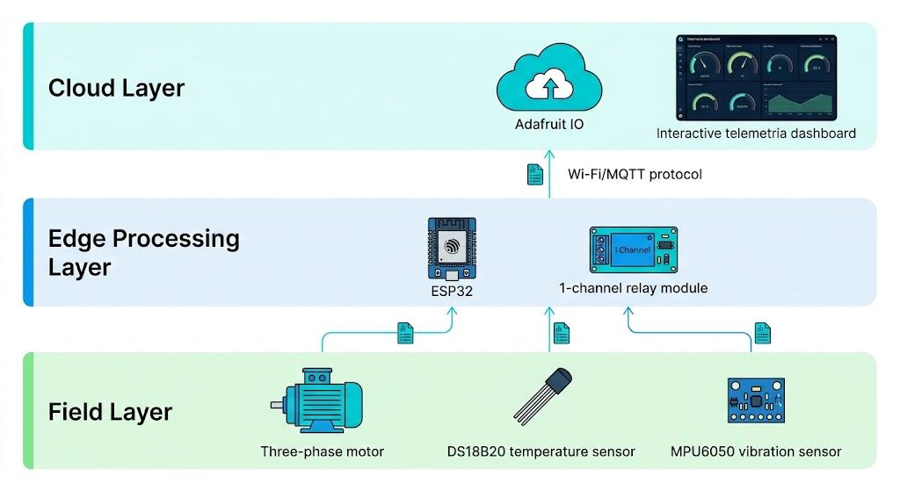

# ⚡ Sistema IoT para Monitoramento e Proteção de Motores Elétricos

> Protótipo funcional de monitoramento de condição de motores elétricos utilizando ESP32, sensores, MQTT e telemetria em nuvem.

---

## 📌 Visão Geral

Motores elétricos estão sujeitos a condições anormais de operação que podem contribuir para falhas e paradas não planejadas.

Este projeto apresenta um protótipo de **monitoramento de condição e proteção de um motor elétrico**, utilizando um ESP32 para aquisição de dados de temperatura e vibração, processamento local das informações e comunicação com uma plataforma IoT.

Quando uma condição crítica é identificada, o sistema pode atuar sobre o **circuito de comando do contator**, realizando o desarme do motor.

Ao mesmo tempo, os dados coletados são enviados através do protocolo MQTT para uma plataforma em nuvem, permitindo a supervisão das condições monitoradas.

---

## 🎯 Objetivos

O projeto foi desenvolvido com os seguintes objetivos:

- Monitorar temperatura do motor
- Monitorar vibração
- Processar as informações localmente no ESP32
- Identificar condições anormais de operação
- Atuar sobre o circuito de comando em condições de falha
- Enviar dados de telemetria através de MQTT
- Disponibilizar informações para supervisão em nuvem
- Demonstrar a integração entre elétrica industrial, sistemas embarcados e IoT

---

## 🏗️ Arquitetura do Sistema

```text
                 CAMPO
                   │
          ┌────────┴────────┐
          │                 │
      DS18B20            MPU6050
    Temperatura          Vibração
          │                 │
          └────────┬────────┘
                   │
                   ▼
                ESP32
          Processamento local
                   │
          ┌────────┴────────┐
          │                 │
          ▼                 ▼
   Análise dos limites     Wi-Fi
          │                 │
          ▼                 ▼
       Relé               MQTT
          │                 │
          ▼                 ▼
Circuito de comando    Adafruit IO
      do contator           │
          │                 ▼
          ▼              Dashboard
 Desarme do motor
```

---

## 🧩 Camadas da Solução
### 1. Camada de Campo

Responsável pela aquisição das informações do equipamento.

**Sensores utilizados:**

- DS18B20 — temperatura
- MPU6050 — aceleração/vibração

---

### 2. Camada da Borda

O **ESP32** atua como unidade de processamento local.

Suas responsabilidades incluem:

- Aquisição dos sensores
- Processamento das leituras
- Comparação com limites configurados
- Identificação de condições críticas
- Controle da saída de proteção
- Preparação dos dados para telemetria

---

### 3. Camada de Comunicação

A comunicação entre o dispositivo e a plataforma IoT é realizada através de:

- Wi-Fi
- MQTT

O MQTT é utilizado para transmissão das informações de telemetria.

---

### 4. Camada da Nuvem

Os dados são enviados para o **Adafruit IO**, permitindo visualizar as informações através de um dashboard.

---

## 🛠️ Hardware

| Componente              | Função                                  |
| :---------------------- | :-------------------------------------- |
| **ESP32**               | Processamento local e comunicação Wi-Fi |
| **DS18B20**             | Medição de temperatura                  |
| **MPU6050**             | Medição de aceleração e vibração        |
| **Módulo Relé 1 Canal** | Atuação sobre o circuito de comando     |
| **Motor trifásico**     | Equipamento monitorado                  |
| **Contator**            | Comando do motor                        |

---

## ⚙️ Funcionamento

O funcionamento básico do sistema ocorre da seguinte forma:

### 1. Aquisição

O ESP32 realiza a leitura dos sensores:
```text
DS18B20 → Temperatura
MPU6050 → Vibração
```

### 2. Processamento

As leituras são processadas localmente no ESP32.

Os valores são comparados com os limites definidos no firmware.

### 3. Detecção de condição crítica

Quando uma condição monitorada ultrapassa o limite configurado, o sistema identifica uma condição de falha.

### 4. Proteção

O ESP32 aciona o módulo relé, que atua sobre o **circuito de comando do contator.**
```text
Condição crítica
       ↓
     ESP32
       ↓
      Relé
       ↓
Circuito de comando
       ↓
   Contator desarma
       ↓
      Motor
```

### 5. Telemetria

Independentemente da atuação local, os dados são enviados para a plataforma IoT através do protocolo MQTT.

---

## 🌐 Comunicação IoT

O firmware utiliza o protocolo **MQTT** para transmissão das informações.

Fluxo de comunicação:
```text
ESP32
  ↓
Wi-Fi
  ↓
MQTT
  ↓
Adafruit IO
  ↓
Dashboard
```

---

## 📊 Telemetria

O projeto utiliza diferentes informações para supervisão do sistema.

## 🌡️ Temperatura

Feed utilizado:
```text
temperatura
```

Limite crítico configurado no protótipo:
```text
70 °C
```

---

## 📳 Vibração

Feed utilizado:
```text
vibracao
```

Limite configurado no protótipo:
```text
15.0 m/s²
```

---

## 🚨 Status de Falha

Feed utilizado:
```text
status-falha
```

Representação:
```text
0 → Operação normal
1 → Motor desarmado
```

---

## 🔌 Interface com o Circuito Elétrico

A atuação do ESP32 ocorre através de um módulo relé conectado ao circuito de comando.
```text
ESP32
  │
  │ GPIO
  ▼
Módulo Relé
  │
  ▼
Circuito de comando
  │
  ▼
Bobina do contator
  │
  ▼
Motor trifásico
```

> ⚠️ O relé atua sobre o circuito de comando do contator. O ESP32 não realiza diretamente o chaveamento da potência do motor.
---

## 🧪 Simulação Interativa

O projeto possui uma simulação desenvolvida no Wokwi, permitindo testar o funcionamento do firmware e observar a resposta do sistema.

👉 **[Acessar Simulação Interativa no Wokwi](https://wokwi.com/projects/472917469255290881)**

A simulação permite observar a interação entre:

- ESP32
- Sensores
- Lógica de proteção
- Relé
- Telemetria

---

## 📐 Diagramas
### Arquitetura do Sistema

---

### Esquemático do Circuito

---

### Motor em Funcionamento

---

### Motor em Condição de Falha

---

## 🔄 Fluxo Geral
```text
        Sensores
           │
           ▼
         ESP32
           │
     ┌─────┴─────┐
     │           │
     ▼           ▼
 Análise       MQTT
     │           │
     ▼           ▼
  Condição   Adafruit IO
   crítica       │
     │           ▼
     ▼        Dashboard
   Relé
     │
     ▼
Circuito de comando
     │
     ▼
  Contator
     │
     ▼
   Motor
```

---

## 🛠️ Tecnologias Utilizadas
### Hardware / Embedded
- ESP32
- DS18B20
- MPU6050
- Módulo Relé
- Motor trifásico
- Contator
### Firmware
- C++
- Arduino Framework
- IoT
- MQTT
- Wi-Fi
- Adafruit IO
### Simulação
- Wokwi
- CadeSimu

---

## 📚 Conceitos Aplicados

Durante o desenvolvimento foram aplicados conceitos relacionados a:

- Sistemas embarcados
- IoT Industrial
- Aquisição de dados
- Sensoriamento
- Processamento local
- Comunicação MQTT
- Telemetria
- Monitoramento de condição
- Lógica de proteção
- Automação de circuitos de comando
- Integração entre hardware e software

---

## ⚠️ Limitações do Protótipo

Este projeto possui finalidade **educacional e de demonstração técnica.**

As medições e condições apresentadas na simulação não representam um sistema industrial certificado.

Para uma aplicação real seriam necessários, entre outros aspectos:

- Sensores industriais apropriados
- Condicionamento de sinais
- Isolação elétrica adequada
- Calibração dos instrumentos
- Validação das medições
- Proteções elétricas apropriadas
- Projeto de segurança e comando
- Avaliação das condições de instalação

O protótipo demonstra principalmente a integração entre **monitoramento, processamento local, comunicação IoT e atuação.**

---

## 🔮 Possíveis Evoluções

Como evolução do projeto, podem ser implementados:

- Armazenamento histórico das medições
- Alarmes configuráveis
- Registro de eventos
- Análise de tendências
- Detecção de padrões anormais
- Dashboard mais completo
- Comunicação com sistemas supervisórios
- Integração com outros protocolos industriais
- Utilização de sensores industriais
- Expansão para múltiplos motores

---

## 🚧 Status do Projeto

### Protótipo funcional

O sistema possui firmware, simulação, monitoramento via MQTT e lógica de atuação desenvolvidos.

Novas melhorias e evoluções podem ser implementadas posteriormente.

---

## 👨‍💻 Autor

### Raphael Alves Ferreira

Desenvolvimento de soluções em **Automação Industrial, IoT e sistemas embarcados.**
- [GitHub](https://github.com/rapha0311)
