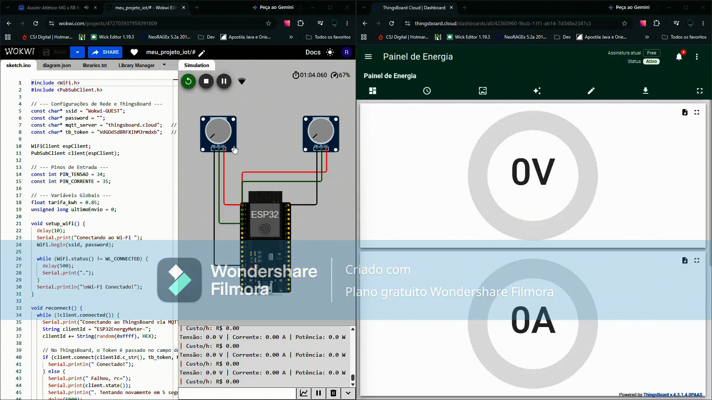
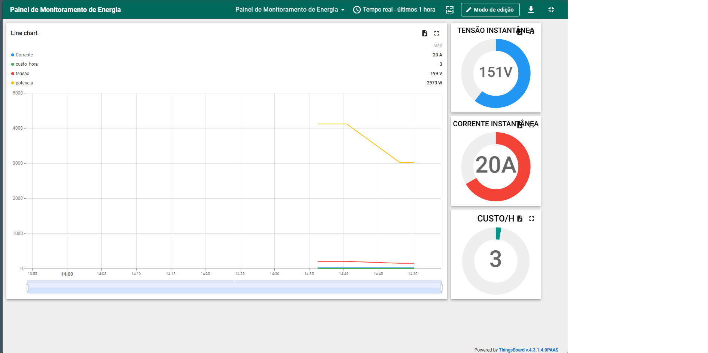

# ⚡ Sistema IoT de Monitoramento de Energia Elétrica

> Monitoramento de tensão, corrente, potência e estimativa de custo utilizando ESP32, MQTT e ThingsBoard Cloud.

---

## 📌 Visão Geral

O projeto implementa um sistema de monitoramento energético baseado em ESP32.

O dispositivo realiza a aquisição de sinais de tensão e corrente, processa os dados localmente e calcula grandezas elétricas para posterior transmissão via MQTT ao ThingsBoard Cloud.

### Principais funcionalidades

- Aquisição de sinais de tensão e corrente;
- Cálculo de potência ativa;
- Estimativa de custo de energia;
- Processamento local no ESP32;
- Publicação de telemetria via MQTT;
- Envio de dados estruturados em JSON;
- Dashboard para visualização em tempo real;
- Histórico das grandezas monitoradas.

---

## 🛠️ Tecnologias Utilizadas
* **Firmware:** C++ / Arduino Framework / ESP32
* **Simulação:** Wokwi Simulator
* **Protocolo de Comunicação:** MQTT (Biblioteca `PubSubClient`)
* **Plataforma Cloud:** ThingsBoard Cloud

---

## 🧠 Processamento Edge

O ESP32 atua como dispositivo de borda (*edge device*), realizando o processamento inicial dos dados antes do envio para a nuvem.

Fluxo simplificado:

Sensores → ESP32 → Processamento → MQTT → ThingsBoard → Dashboard

---

## 🔗 Links do Projeto
1. 🎮 **Simulação Ativa:** Teste o firmware interativamente pelo [Wokwi](https://wokwi.com/projects/472703937958391809).
2. 📈 **Dashboard no ThingsBoard:** 


---

## 💻 Como Executar
1. Acesse o projeto no [Wokwi](https://wokwi.com/projects/472703937958391809).
2. Clique no botão **Play** para iniciar a simulação.
3. Altere os valores nos dois potenciômetros para simular variações de Tensão e Corrente.
4. Observe os dados sendo atualizados no Monitor Serial e no Dashboard do ThingsBoard Cloud.



## 🏗️ Arquitetura do Sistema

```text
Sinais de tensão/corrente
          ↓
        ESP32
          ↓
   Processamento Edge
          ↓
      MQTT / JSON
          ↓
  ThingsBoard Cloud
          ↓
      Dashboard
```

---

```markdown
## ⚠️ Limitações do Protótipo
```

Este projeto utiliza sinais simulados no ambiente Wokwi para representar as medições de tensão e corrente.

O sistema não deve ser utilizado como instrumento de medição elétrica real sem sensores apropriados, condicionamento de sinal, calibração e validação metrológica.

O objetivo do projeto é demonstrar conceitos de aquisição de dados, processamento Edge, comunicação MQTT e supervisão em nuvem.


---
